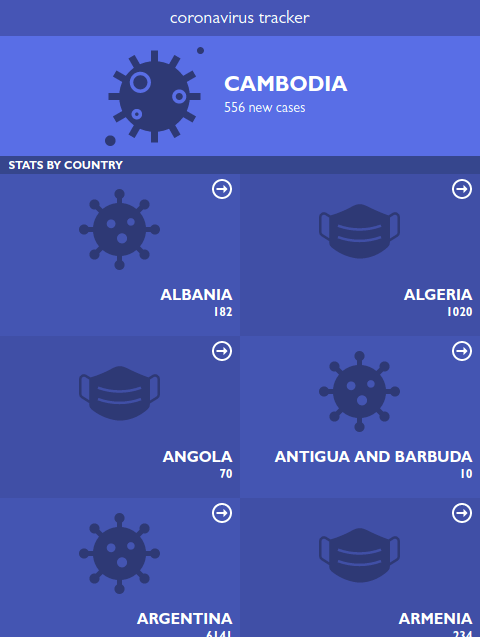
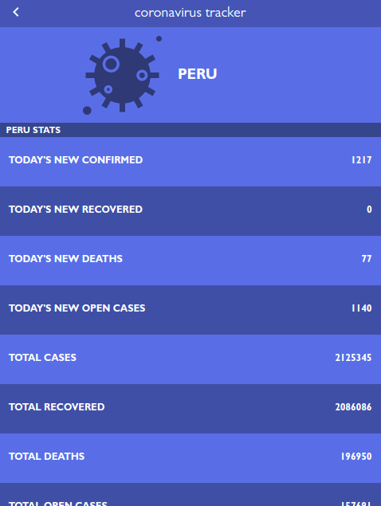

# COVID19 Tracker

The COVID-19 Tracker web application collects information from different data sources to provide comprehensive data for the novel coronavirus, SARS-CoV-2

## Table of contents

- [Overview](#overview)
  - [Screenshot](#screenshot)
  - [Live Demo](#live-demo)
  - [Available scripts](#available-scripts)
- [My process](#my-process)
  - [Built with](#built-with)
  - [Useful resources](#useful-resources)
  - [Acknowledgments](#acknowledgments)
- [Author](#author)

## Overview

### Screenshot





### Live Demo

- [Netlify](https://covid19-tracker-alonsofalconi.netlify.app/)

### Available Scripts

- Clone this repository
```bash
$ git clone git@github.com:alonsofl/covid19-tracker.git
$ cd covid19-tracker/
```

- Run the app
```bash
$ npm start # Runs the app in the development mode.
```

- Or build
```bash
$ npm run build # Builds the app for production to the `build` folder.
```

## My process

### Built with

- HTML5
- CSS
- Javascript (ES6)
- React

### Useful resources

- [Create a new React app](https://reactjs.org/docs/create-a-new-react-app.html)
- [Conditional Rendering](https://reactjs.org/docs/conditional-rendering.html)

## Acknowledgments

- Icons from [Material Design](https://materialdesignicons.com)

## Author

**Alonso Falconi**
- GitHub - [@alonsofl](https://github.com/alonsofl)
- Twitter - [@AlonsoFalconi](https://www.twitter.com/AlonsoFalconi)
- LinkedIn - [Alonso Falconi](https://www.linkedin.com/in/alonsofalconi/)

Give a ⭐️ if you like this project!